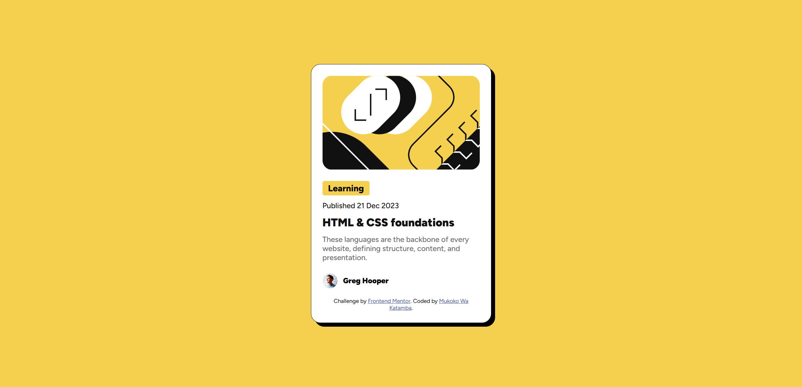
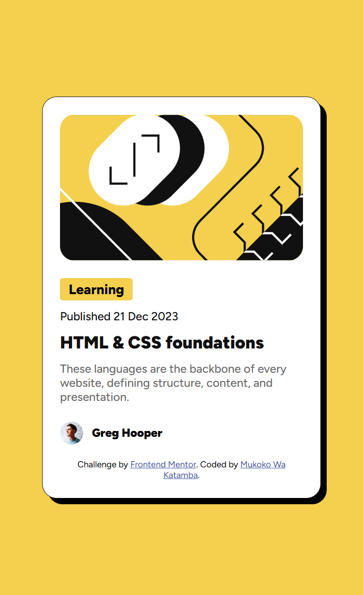

# Blog Preview Card


## 📋 Table des matières

- [Aperçu](#aperçu)
  - [Le défi](#le-défi)
  - [Captures d'écran](#captures-décran)
  - [Liens](#liens)
- [Mon processus](#mon-processus)
  - [Technologies utilisées](#technologies-utilisées)
  - [Fonctionnalités](#fonctionnalités)
  - [Ce que j'ai appris](#ce-que-jai-appris)
  - [Développement continu](#développement-continu)
- [Installation](#installation)
- [Auteur](#auteur)

## 📖 Aperçu

### Le défi

Ce projet est un défi Frontend Mentor visant à créer une carte de prévisualisation de blog responsive et interactive. L'objectif est de reproduire le design fourni avec précision tout en implémentant des états interactifs.

Les utilisateurs doivent pouvoir :

- ✅ Voir les états de survol et de focus pour tous les éléments interactifs
- ✅ Visualiser une mise en page optimale selon la taille de leur appareil
- ✅ Bénéficier d'une expérience utilisateur fluide et moderne

### Captures d'écran

````carousel

<!-- slide -->

````

## 🚀 Mon processus

### Technologies utilisées

- **HTML5** - Structure sémantique
- **SCSS/CSS3** - Styles modernes avec variables CSS
- **Flexbox** - Mise en page flexible
- **Google Fonts** - Typographie Figtree
- **Design responsive** - Mobile-first workflow

### Fonctionnalités

#### 🎨 Design System

Le projet utilise un système de design cohérent avec des variables CSS personnalisées :

```scss
:root {
  --color-gray-500: rgb(107 107 107);
  --color-gray-950: rgb(17 17 17);
  --color-white: rgb(255 255 255);
  --color-yellow: rgb(244 208 78);
  --font-size-text-preset-1: 24px;
  --font-size-text-preset-2: 16px;
  --font-size-text-preset-3: 14px;
  --spacing-100: 8px;
  --spacing-150: 12px;
  --spacing-200: 24px;
  --spacing-50: 4px;
}
```

#### ✨ Interactions

- **Effet de survol** sur le titre avec changement de couleur vers le jaune
- **Ombre portée** distinctive pour un effet de profondeur (box-shadow: 8px 8px 0px 0px #000)
- **Bordures arrondies** pour une esthétique moderne
- **Badge catégorie** avec fond jaune pour une meilleure visibilité

#### 📱 Responsive Design

- Carte centrée verticalement et horizontalement
- Largeur fixe de 384px pour une lisibilité optimale
- Images responsive avec border-radius cohérent
- Typographie adaptative avec la police Figtree

### Ce que j'ai appris

Ce projet m'a permis de renforcer mes compétences en :

1. **Variables CSS personnalisées** - Création d'un système de design réutilisable et maintenable
2. **SCSS** - Utilisation de Sass pour une meilleure organisation du code CSS
3. **Flexbox** - Maîtrise du positionnement et de l'alignement des éléments
4. **États interactifs** - Implémentation d'effets de survol élégants
5. **Box-shadow** - Création d'effets d'ombre portée pour donner de la profondeur

Exemple de code dont je suis particulièrement fier :

```css
h1:hover {
  color: var(--color-yellow);
  cursor: pointer;
}
```

Cette simple interaction améliore considérablement l'expérience utilisateur en fournissant un feedback visuel immédiat.

### Développement continu

Pour les prochaines itérations, j'aimerais :

- 🔄 Ajouter des animations de transition plus fluides
- 📊 Implémenter plusieurs variantes de cartes
- 🌐 Créer une grille de cartes responsive
- ♿ Améliorer l'accessibilité avec ARIA labels
- 🎭 Ajouter un mode sombre

## 💾 Installation

Pour exécuter ce projet localement :

```bash
# Cloner le dépôt
git clone https://github.com/votre-username/blog-preview-card.git

# Naviguer dans le dossier
cd blog-preview-card

# Ouvrir index.html dans votre navigateur
# Ou utiliser un serveur local comme Live Server
```

Si vous souhaitez modifier les styles SCSS :

```bash
# Compiler SCSS en CSS (nécessite Sass)
sass --watch styles.scss:styles.css
```

## 👤 Auteur

- **Frontend Mentor** - [@Overallfall](https://www.frontendmentor.io/home)
- **GitHub** - [@Overallfall](https://github.com/Overallfall)
- **Codé par** - Mukoko Wa Katamba

---

**Challenge par** [Frontend Mentor](https://www.frontendmentor.io?ref=challenge)  
**Codé par** Mukoko Wa Katamba

> [!NOTE]
> Ce projet fait partie de ma progression en développement frontend. N'hésitez pas à me faire part de vos retours et suggestions d'amélioration !
